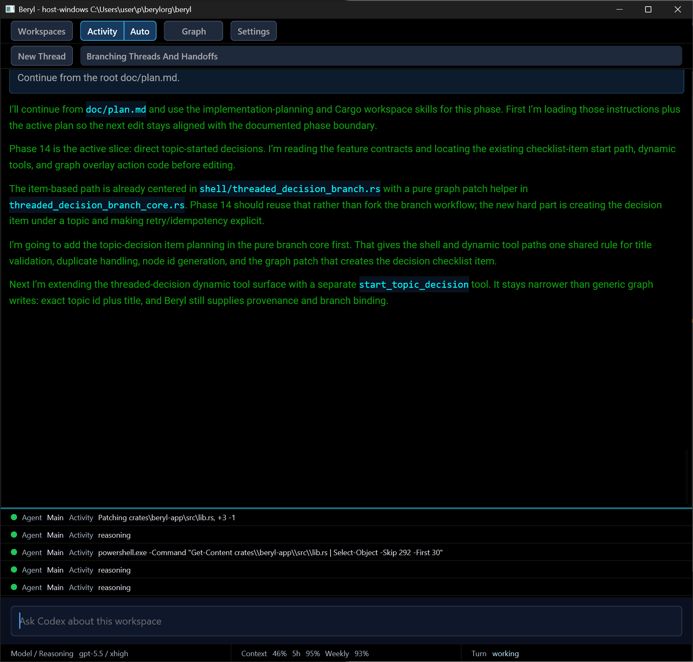

# Intro

Beryl is a GUI app built on top of Codex App Server.

No official releases yet. The mainline is stable and working on Windows, as I'm developing Beryl with Beryl, but there are no backward compatibility guarantees yet, everything is in flux.

Key features:
- Agent tools that let AI interact with Beryl on a programmatic level: diagnostics, graph management, conversation (thread) management.
- Built-in semantic graph that is automatically updated by the AI based on conversations
- Branch -> explore -> merge conversation workflow for easier decision making
- Full GUI theming (colors and fonts)
- Sound notifications
- WSL support
- Autonomous mode that turns every plan phase into an individual conversation turn with compaction in between

Should be cross-platform, but I don't have Macos to test that.

# At a glance

# AI harness

To work with Beryl's codebase, install skills from <https://github.com/berylorg/aipm>.
