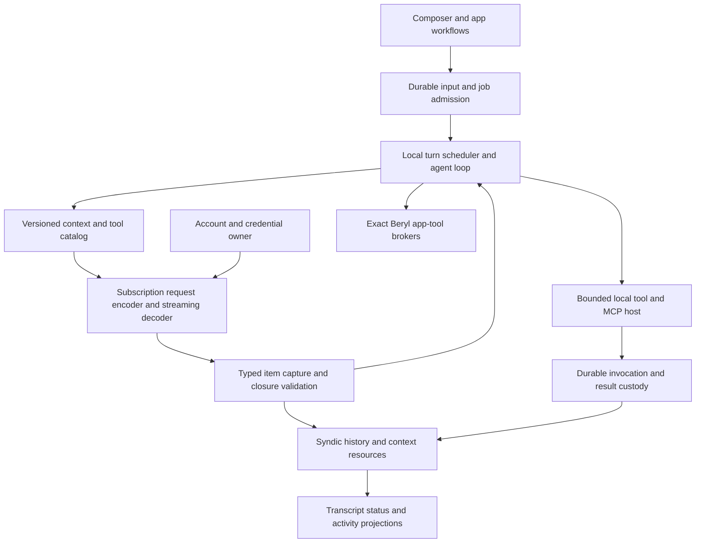

# Reason For Investigation

Operator requested a full investigation of replacing CAS with Beryl-owned execution over personal
ChatGPT Pro subscription APIs, especially whether response ordering forces large buffering.
This is the decision package from the 2026-09-17 investigation. It proposes a direction and
adoption gates; it does not amend design authority or release the production rework hold.

# Outcome

**Recommend pursuing a Beryl-owned agent loop and context over direct subscription HTTP streaming,
with selected Rust reuse and a separately bounded local tool host.** Direct authentication is
the preferred ownership target; keep an auth-only helper as an alternative if secure login/refresh
ownership materially reduces scope. No observed access problem requires CAS for inference.

This is a conditional recommendation. Authentic direct requests established the core transport
and continuation mechanisms. They did not prove universal lossless event coverage, end-to-end
memory bounds, sandbox correctness, seamless old-thread conversion or coding quality parity.
Those limits are adoption gates, not fine print to erase when implementation starts.

The likely benefit is a simpler ownership model, not necessarily less total code. Beryl already
owns durable user intent and history; making it own the agent loop removes reconciliation with
CAS-native execution state. It also makes Beryl responsible for substantial runtime behavior.

## What The Direct Evidence Actually Establishes

The direct probes used the current authorized access token in memory and subscription endpoints,
without CAS/Codex response decoders or Platform API calls. Actual function/custom tool continuations,
opaque reasoning reuse, Lite streaming compaction, standalone web search and representative image
generation succeeded. Results and exact limitations are preserved in the linked evidence below.

Observed completed items put identity/type before their large payload. Some deltas and redundant
completion fields put payload before item identity. Local request ownership is known before the
response, unlike the CAS wrapping that supplies thread/turn routing after content. This removes
the demonstrated CAS routing dependency; it does not eliminate every inner-item ordering question.

No established required path was found that inevitably forces ordering-related disk spill.
Reasoning summaries, annotations/refusals, nonempty terminal echoes and absent/late identities
still need direct coverage or explicitly supported bounded failure. A fixed prefix allowance is
compatible with bounded memory; overflowing it must not create an unbounded buffer or spool.

The terminal `response.completed.response.output` arrays inspected were empty despite preceding
completed items. The new runtime must retain actual completed items, not rely on terminal replay.
Compaction succeeded through ordinary streaming Responses with a trigger; two unary 404s do not
establish that compaction is unavailable. The tiny test retained original user text and therefore
did not establish summary-only recall quality.

## Candidate Components And Dataflow

These are responsibilities, not a mandate for this many services or packages. Reuse existing
home writer, admission, reconciliation, bounded queues, brokers and presentation where their
semantics fit. Keep credentials outside conversation payload storage. Keep OS effects outside
GUI authority and require exact app brokers for themes, lifecycle and branch handoff.

One accepted turn may contain several model attempts and tool invocations. Commit dispatch
custody before sending, collect completed items, validate closure and calls, execute admitted
tools, persist results, then construct the next request. A conservative initial design waits for
successful response closure before local effects. Earlier dispatch is a separate latency choice.
Stopping fences new work; it does not prove remote generation stopped. Unknown tool effects
remain unknown, and later user retry is a new durable submission rather than silent replay.

## Concrete Simplifications

- Remove CAS executable/release admission and app-server listener/startup protocol from inference.
  Tool helpers may still require their own packaging and lifetime supervision.
- Remove competing native-thread and Beryl-thread state, one-time history injection, CAS fork/
  rollback mirroring, loaded projection preparation and historical repair transport where the
  replacement owns exact input/output from admission onward.
- Assign thread/turn/request ownership before network I/O; eliminate CAS's late outer routing
  dependency without decoder-side payload staging.
- Construct branch/edit context from exact local lineage. Child identity, model and effort are
  directly known rather than discovered through backend nickname/metadata calls.
- Use ordinary request-purpose isolation for titles and maintenance instead of native maintenance
  sessions. Keep their instruction, notification and background-work rules.

No simplification removes storage integrity, incomplete outcomes, exact input custody, bounded
rendering, shutdown, branch jobs or process containment. Existing incomplete bootstrap and branch
coordination remain unfinished work, not costs created by this proposal.

## New Or Substantially Rewritten Work

- Subscription HTTP/TLS/SSE, catalog-selected dialects, token/account ownership and classified
  errors; optional WebSocket prefix reuse only after explicit context works reliably.
- Agent-loop termination, steering mailbox semantics, request snapshots, tool dispatch/result
  pairing, stop arbitration and crash/unknown-effect recovery.
- Context resources and revision selection, instruction provenance, media transformation, budgets,
  compaction retention, model compatibility and branch-before-compaction correctness.
- Shell/PTY/process execution, file/patch/search policy, sandbox integration, output bounds and
  cancellation across retained native/WSL environments.
- Code mode where selected models require it. The inspected reusable V8 session disables the
  supplied heap limit; unchanged import is not a proven bounded host. Patch reuse also brings
  execution-server dependencies and whole-file allocation/partial-effect behavior.
- AGENTS/configuration/skills/plugin discovery and reload; chosen MCP versions/transports,
  catalog revisions, OAuth, result resources and owned-process shutdown.
- Subagent contexts, model/effort selection, mailboxes, waits, quotas, result delivery and orphan
  handling; adapt Beryl's existing branch/lifecycle jobs to exact local runtime identities.
- Product runtime/account/recovery changes, generated-image admission, diagnostics, packaging,
  dependency/security updates and existing-home data policy.

The [package disposition](storage-and-product-changes.md) locates retain/rewrite/remove/new work.
Relative effort is concentrated in context/effect durability, cross-platform tools/sandboxing,
code mode and integration compatibility. Transport alone is the smaller part. A credible calendar
or net-line-count estimate requires selecting these envelopes and the old-home strategy first.

## Alternatives

**Keep CAS and fix producer ordering upstream/in a fork.** Preserves its runtime functionality and
reduces new agent-host work. It retains dual state, native context/repair constraints and release
coupling. Current supported CAS ordering does not satisfy the blocked ingress assumption; this
option needs a proven producer change rather than the rejected decoder-only rearrangement.

**Direct runtime with selective execution-library/helper reuse — recommended direction.** Gives
Beryl one durable owner and direct control of bounded dataflow while reusing narrow PTY/parser/
MCP components where worthwhile. Tool helper and JS isolation must remain bounded and explicit.
Dependency reuse is a cost reduction candidate, not evidence that security/resource contracts
already match. The final package/process split remains a design decision.

**Import a large Codex core or replace CAS with a near-complete Codex-derived daemon.** May preserve
more behavior quickly, but imports configuration, auth, session/history and retry assumptions.
It risks rebuilding the same competing ownership boundary under a different protocol. Prefer it
only if a concrete dependency analysis demonstrates a narrower owned boundary than current CAS.

**Direct transport plus auth-only official helper.** Same runtime/context/tool work as the direct
option. Can reduce login work but still needs secure handoff, single refresh ownership, version
admission and helper lifetime. No direct evidence currently makes it necessary.

## Choices To Resolve Before Design Adoption

1. **Streaming/storage:** preserve the no-ordering-spill constraint. Choose the final backing for
   typed context resources and supported behavior for unobserved/oversized pre-identity payloads.
   Canonical text already uses bounded indexed records; digest-addressed sidecars use temporary
   construction. Do not conflate all large resources or disguise a routing spool as final storage.
2. **Tool/model envelope:** retain required model-guided code mode or demonstrate that a simpler
   tool mode is adequate for explicitly selected models. Choose execution/sandbox reuse and
   retained platforms. Do not silently drop WSL/cross-platform requirements or add approval UI.
3. **Integration envelope:** choose local configuration/AGENTS/skills/plugins and MCP support;
   define unsupported marketplace/hosted-App behavior explicitly. Preserve V1 approval denial.
4. **Credential owner:** direct login/refresh preferred, with one owner across homes/processes;
   auth helper only for a concrete advantage. Personal-Pro-only admission needs qualification.
5. **Old homes and context:** retain readable history; select exact conversion, unavailable old
   continuation, or an explicit new-home boundary. No automatic deletion or approximate replay.

These are concrete design decisions, not requests to authorize more speculative probes. A small
experimental vertical slice can precede broad adoption if the Operator requires stronger quality
or streaming evidence first. It needs its own bounded scope and does not resume the old rework.

## Evidence Gates And Deferred Validation

The [verification specification](verification-gates.md) separates direct API observations,
offline parser/failure tests and future end-to-end quality. No additional quota was consumed to
write these subsystem assessments. A single repository task would be a feasibility smoke test,
not general coding-quality parity even if it succeeds.

Before unconditional adoption, close required event-order/storage gates and select failure
semantics. Before production, qualify credentials, bounded memory/dataflow, effect/crash cuts,
context/compaction/model switches, tools/sandbox, supported integrations and platforms. Before
distribution, qualify the actual dependency/licenses/native helper set. Do not represent these
as already passed because the small direct requests succeeded.

## Authority Update Map

If Operator selects this direction, reconcile these controlling areas before implementation:

- Root `doc/design.md`: CAS-only/non-reimplementation boundaries, persistence ownership,
  subscription scope, retained safety/platform/resource rules.
- Systems `backend-runtime`, `cas-live-syndic-transcript`, `syndic-conversation-history`,
  `beryl-home-storage`: replace native provider ownership with direct execution/context/capture,
  typed domains, final-resource publication and exact recovery. Retire obsolete authority rather
  than maintaining two live architectures.
- Systems `branch-discussion-handoff`, `image-assets`, `bounded-resource-dataflow`: local dispatch
  custody, generated-media producer, resource limits and failure publication. Retain semantic
  provenance and job/archive barriers.
- Features composer, conversation threads, status line, Settings, recovery, activity, diagnostics,
  lifecycle and image assets: steering/compaction/stop/account/runtime meanings and exact unknown
  states. Keep windows, notifications and app-tool authority consistent.
- Owning package docs: derive responsibilities and APIs from reconciled system/feature authority;
  resolve engineering-rigor requirements before implementation acceptance criteria.
- `doc/rework/beryl-home/REWORK.md` and root `doc/plan.md`: retire or reconcile blocked CAS work,
  preserve still-valid storage/UI work and unfinished product gates, then derive a fresh bounded
  implementation window. Generic continue does not release the hold.

This map is proposed sequencing for an Operator decision, not an approved design change.

# Sources

- Direct 2026-09-17 evidence: [access/account](subscription-auth-assessment.md),
  [catalog/dialect](subscription-inference-surface.md), [tool/reasoning](direct-stream-continuation.md),
  [compaction](subscription-streaming-compaction.md), [web/images](subscription-web-image-results.md),
  [ordering assessment](ordering-and-bounded-streaming.md). Each preserves exact observed limits.
- Reviewed subsystem research: [requirement inventory](cas-responsibility-inventory.md),
  [execution](durable-execution-and-recovery.md), [context](context-and-compaction.md),
  [tools](local-tool-host-options.md), [integrations](configuration-and-integrations.md),
  [scheduling](scheduling-and-branches.md), [storage/product](storage-and-product-changes.md),
  [operations](operations-and-maintenance.md), [verification](verification-gates.md).
- Pinned source identities and precise paths are retained in those notes: Codex
  `6b9826e3aa83b1a5947db50f4332cb9c65f1b340`, OpenCode
  `5a8335857b0ebec44ef6aa1d52b339cf25c329ca`; source is not substituted for direct service evidence.
- Current Operator-owned root/feature/system/package/rework authority is the comparison baseline.
  Completion review on 2026-09-17 accepted this package for a conditional Operator decision with
  no material blocker. It checked root-authored synthesis and requirement/authority coverage;
  the reviewer also contributed source research and did not independently replicate live probes.
  This is not production acceptance, implementation readiness or approval of the proposed design.
